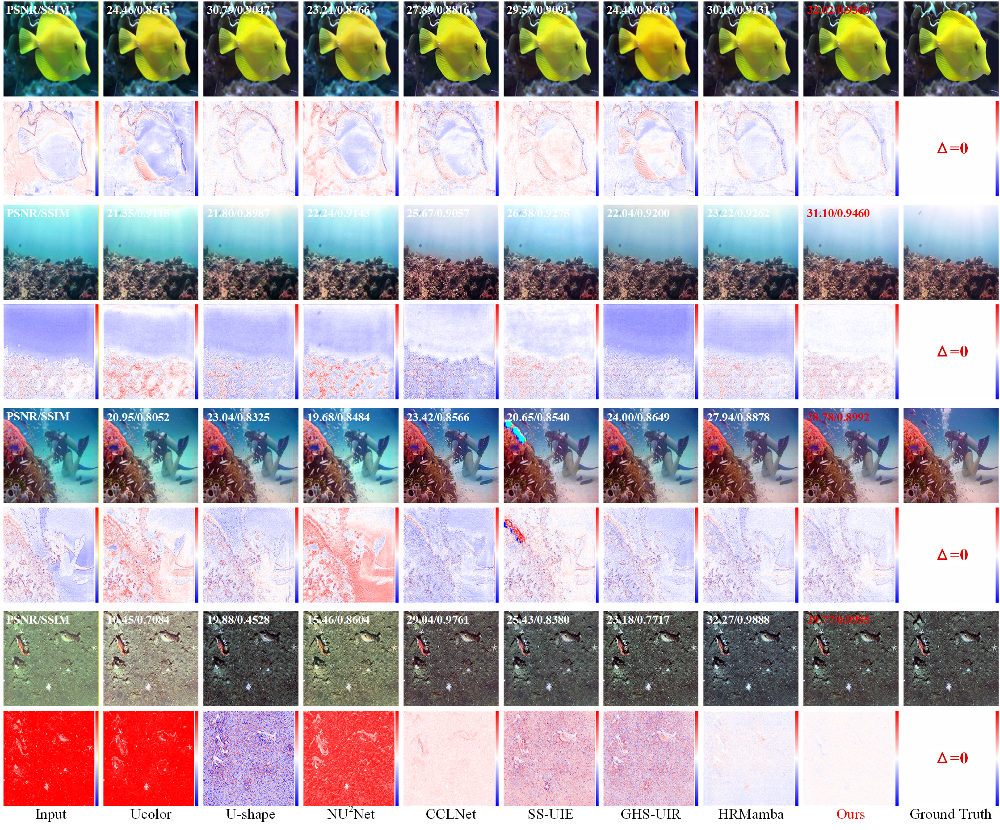

# Multi-level Constrained Learning for Underwater Image Enhancement


Our paper has been submitted for peer review, and we will release the full code once it is officially published.

## Recommended Environment

- [ ] python 3.10 or 3.11
- [ ] pytorch 2.13.0
- [ ] torchvision compatible with the installed PyTorch version
- [ ] opencv-python
- [ ] scikit-image
- [ ] lpips 0.1.4
- [ ] clean-fid 0.1.35

Install dependencies:
pip install -r requirements.txt


## Datasets

The project expects paired training data and paired test data to be organized as follows:

```text
MCL-UIE/
├── Traindata/
│   └── LSUI400/
│       ├── train/
│       │   ├── image_1.jpg
│       │   ├── image_2.jpg
│       │   └── ...
│       └── trainGT/
│           ├── image_1.jpg
│           ├── image_2.jpg
│           └── ...
├── Testdata/
│   └── LSUI400/
│       └── testimage/
│           ├── image_1.jpg
│           ├── image_2.jpg
│           └── ...
└── TestdatasetGT/
    └── LSUI400/
        ├── image_1.jpg
        ├── image_2.jpg
        └── ...
```

## Results

### Visualization Results




### Quantitative Results

Full-reference results of MCL-UIE on paired underwater image enhancement datasets:

| Dataset | PSNR   | SSIM   | LPIPS   | FID   |
| ------- | :----: | :----: | :-----: | :---: |
| EUVP515 | 28.53  | 0.891  |  0.143  | 24.26 |
| LSUI400 | 28.09  | 0.917  |  0.112  | 25.23 |
| UIEB90  | 23.37  | 0.911  |  0.100  | 25.16 |
| UFO120  | 28.02  | 0.868  |  0.148  | 42.08 |

